# Lab 2: Assembly

## Quick Check

First thing you should do before you move on with the rest of the lab is to plug your Pi Pico into your computer and make sure it shows up in your file system like so: 

(NOTE: the image below shows a drive named CIRCUITPY but you probably will see a drive named RPI-RP2. This is expected)

    
     
    <a><b>Updated CIRCUITPY Drive Directory Example image in Windows 10 File Explorer</b></a>

If the Pi Pico when connected to your PC does not show up like the image above shows try a different cable. If that does not work, try a different PC. Finally, if all the above does not work ask your TA for help.

## Assembly

Download the `ibom.html` from the [release](https://github.com/charlessu800/MMv3/blob/better-debugging/releases/download/MMv3.5/ibom.html) and open it in your preferred browser. The interactive BOM (bill of materials) shows what parts are needed on your mouse's PCB (printed circuit board) and where they need to be placed. This html file will be very helpful when assembling your mouse.

To see images of all the individual parts, see the Google Drive link [here](https://drive.google.com/drive/folders/1rGae82BSrE_mvmMwKTBHT9P-unDKIKQj?usp=sharing).

### Reflow Soldering

Let's start with the back of the PCB which is where the majority of parts are located. In the `ibom.html` file you have downloaded then opened in your a browser, click `B` in the top right (highlighted in red) to show just the back side of the PCB. Make sure it looks like below.

    
     
    <a><b>iBOM Back</b></a>

Rather than solder each part by hand, we'll use reflow soldering which does it all at once. In reflow soldering, we place components on top of pads covered in solder paste before sending the whole thing through an oven to melt the solder, making permanent joints.

    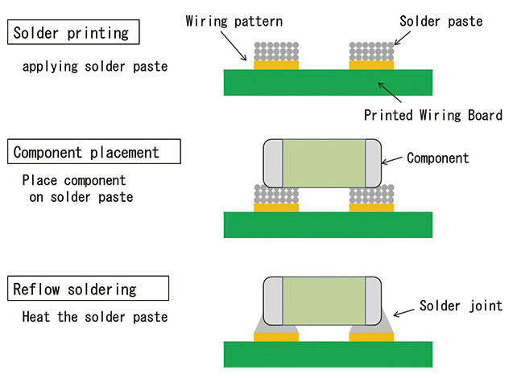
     
    <a><b>Reflow Solder Process</b></a>

Let's start by applying the solder paste using a **solder stencil**. Instead of squeezing the perfect amount onto each pad by hand, we can do it all at once by spreading paste over a stencil with holes cut out precisely where we want paste. For a good solder paste application, it's important to make sure the stencil is flush against the PCB and stays aligned. Tape the stencil onto the table to keep the stencil from moving. The process is very forgiving, so don't worry if your paste looks messy or goes a bit outside the pads after having applied the paste with the stencil. You can use tweezers or something like it to clean up places where pads are shorted togehter. Please ask the TAs if you have any questions about this.  

    
    
    
     
    <a><b>Solder Paste Application Process</b></a>

Now it's time for component placement. Following the `ibom.html`, place all of the components for the back side. None of the symmetric components have polarity, so don't worry about part orientation. Tweezers will be very useful, but don't squeeze too hard or your component will go flying. Again, the process is quite forgiving so don't worry if your parts aren't perfectly aligned as solder surface tension will generally pull them into alignment.

    
    
    
     
    <a><b>Component Placement</b></a>

> [!IMPORTANT]  
> Before moving on, double check that you correctly placed each component in the right place and the right orientation.
> - Are your MOSFET transistors in the right place? Remember that there are 3 x n-channel MOSFETs (Q2,Q3,Q4) and **1 x p-channel MOSFET (Q1)**.
> Now you are ready to show one of your TAs to give it one last lookover before getting reflowed.

Finally, let's reflow the solder! Bring you board with the placed components to your TA. They will do a final check before throwing your board into the reflow oven, loading up the correct profile, and waiting. With any luck, all of your joints will melt and the back side of your board will be done.

    
    
     
    <a><b>Reflow</b></a>

### Hand Soldering

The rest of the components need to be attached by hand. The general process is to heat up both the pad and the part before melting solder onto both of them. Adafruit has a great list of common issues and fixes which can be found [here](https://learn.adafruit.com/adafruit-guide-excellent-soldering/common-problems).  

    
     
    <a><b>How to Make a Solder Joint</b></a>

Let's start off with the mouse's main PCB. Click `F`, located in the top right of the `ibom.html`, to see the remaining components.

    
     
    <a><b>iBOM Front</b></a>

You can hand solder all the components on the Front side of the PCB in any order but there is a preferred way to do so that will be less of a headache when soldering.
1. D2 - D13 (THT LEDs)
2. SW1, SW2 (THT Switches)
3. DRV8833 (Motor Drive Module)
4. J3, J4 (ZH Series JST 6-pin connector)
5. J2, J5 (Receptacle Connector 0.100" (2.54mm) Through Hole Gold)
6. J1 (Keystone_593_594 Battery Contact Snaps)

This is also the order in how the lab has been laid out.

First we solder the IR LEDs. Note that the silkscreen should denote the polarity. The longer line corresponds to the longer leg of the IR LEDs. They also need to be mounted at a right angle so don't be afraid to bend them. Splaying the leads outward should hold them in place while you apply solder.

    
    
     
    <a><b>IR LEDs</b></a>

Next, solder the SW1, SW2 (THT Switches). These components do now have polarity so their orientation does not matter. Additionally, you should solder these switches such that they are on the Front side of the board but if you do not that is okay. They still will work.

    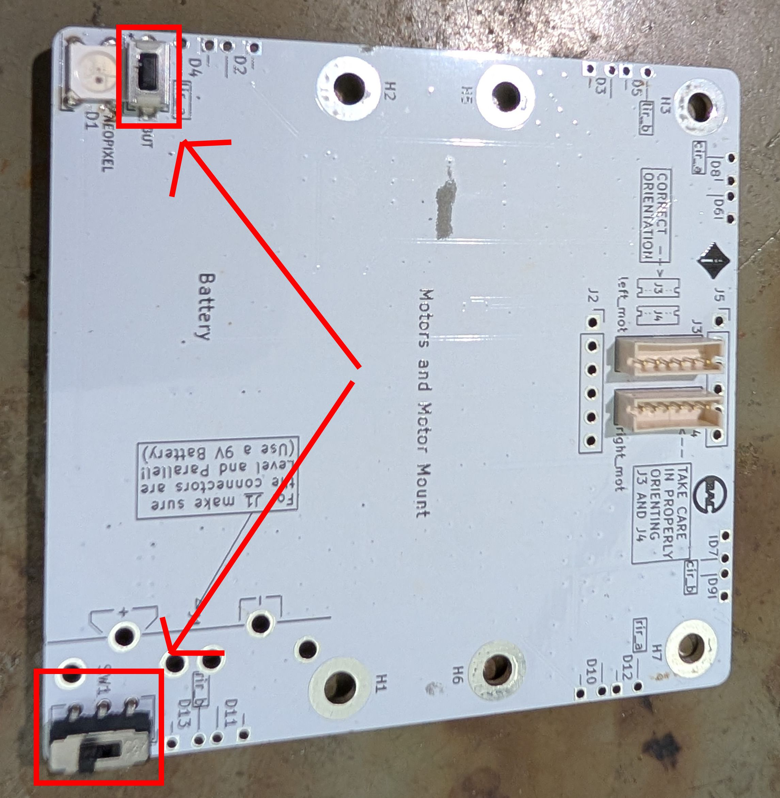
     
    <a><b>THT Switches</b></a>

Now, the DRV8833 motor driver board. Solder the two 6-pin headers onto the board and bridge the `en` pads as shown in the following pictures. Make sure when soldering the two 6-pin headers that you are placing them on the correct side of the board. It should look like the final image below where the `en` pads are on top.

The technique that I find works best is to solder just one pin first with the part in any orientation. Then reheat that joint while pressing on the part to move it into perfect alignment. Finally, do the rest of the pins.

    
    
    
    
     
    <a><b>DRV8833 Motor Driver Assembly</b></a>

Finally, let's add the connector components! We saved these for last because if we did them any sooner it would make soldering the rest of the board more awkward. This is because the bigger components, like the battery connectors and motor connectors, would make it almost impossible to lay the pcb flat on a table.

> [!NOTE]
> Be sure that when you solder these bigger components, motor connectors and such, you place them on the correct side of the board, the Front side. That side is the side opposite of the pi pico. DO NOT solder these bigger components on the same side as the green pi pico. You will save yourself a lot of headaches :D

Lets start by soldering first the J3, J4 (ZH Series JST 6-pin connector) components

    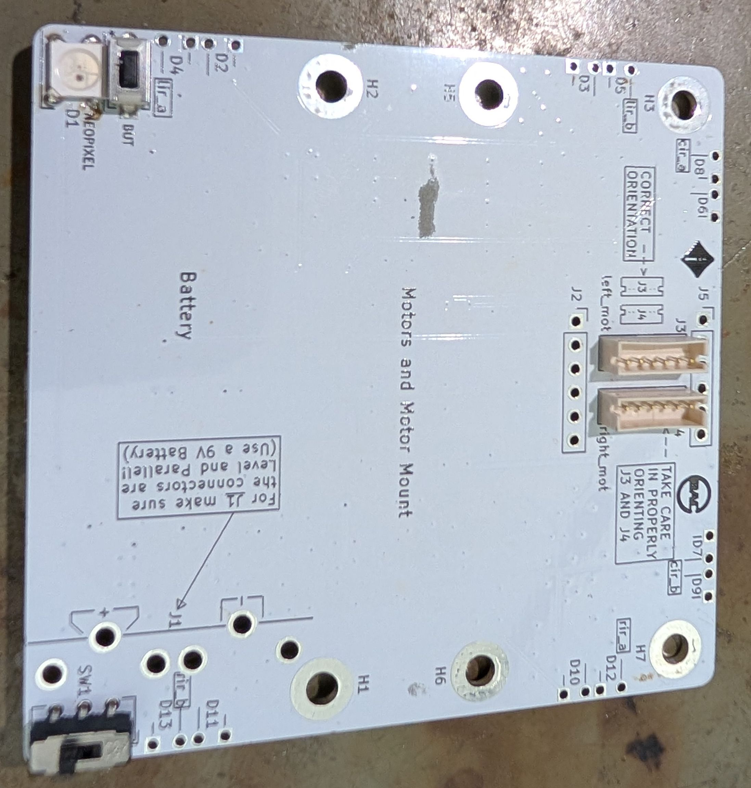
     
    <a><b>J3, J4 (ZH Series JST 6-pin connector)</b></a>

Next solder first the J2, J5 (Receptacle Connector 0.100" (2.54mm) Through Hole Gold)

    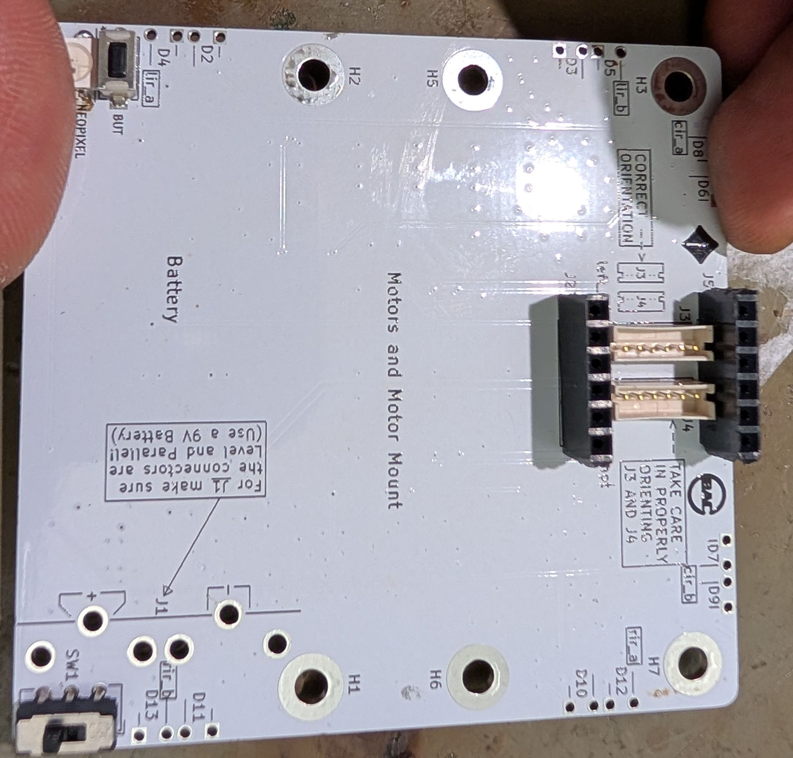
     
    <a><b>J2, J5 (Receptacle Connector 0.100" (2.54mm) Through Hole Gold)
</b></a>

Now let's solder the J1 (Keystone_593_594 Battery Contact Snaps) connectors. When soldering these connectors it is advised to take the two Battery Contact Snaps, positive and negative, and attach them to a 9V battery first before placing them on the board. See the images below. This is to make sure that when you solder them onto the board they are aligned. You can solder the Battery Contact Snaps while the 9V battery is still connected to them.

    
    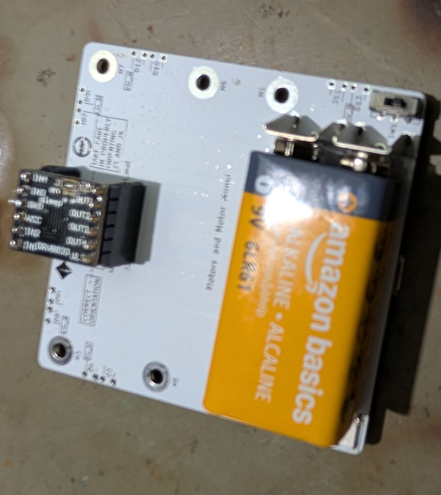
    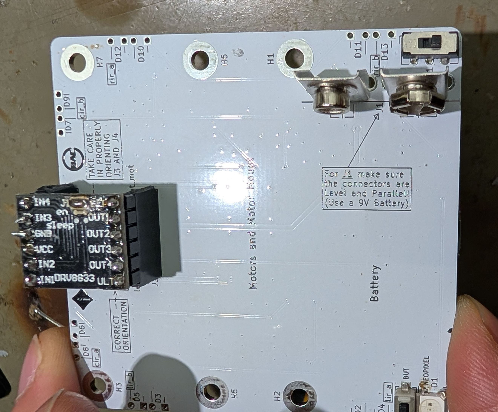
     
    <a><b>Using a 9V Battery for Alignment of the J1 (Keystone_593_594 Battery Contact Snaps)
</b></a>

Additionally, make sure that you place the two Battery Contact Snaps in each of their respectative places. 

    
     
    <a><b>Good Placement
</b></a>

    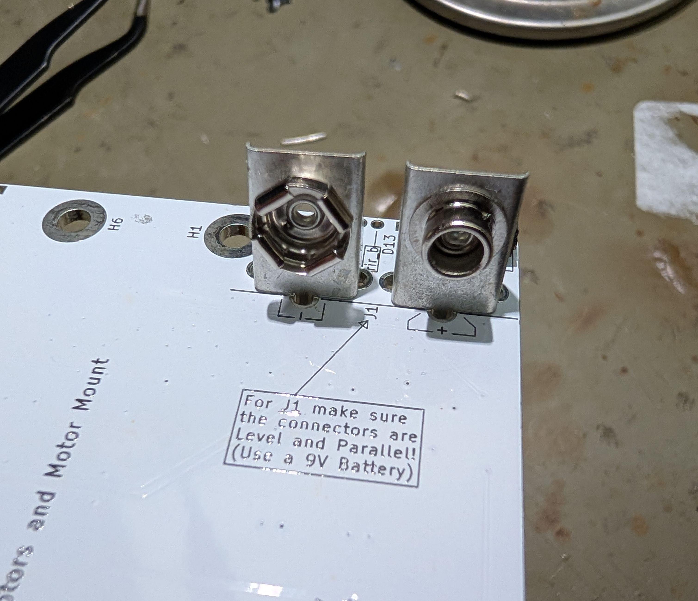
     
    <a><b>Bad Placement
</b></a>

With any luck, your board should be finished! At least all the soldering :)

    
     
    <a><b>PCB with completed soldered components</b></a>

### Optional SMD LED Component

We made the D1 Neopixel LED component optional as it's one of the hardest parts to solder. It is the only hand soldered SMD component. The Neopixel LED uses the same soldering process except there's no hole to stick the part through. Please see this [video (skip to 2:16)](https://youtu.be/RODp8HSlFPA?t=136) on soldering such components if you want to give this a try. You will need tweezers.

    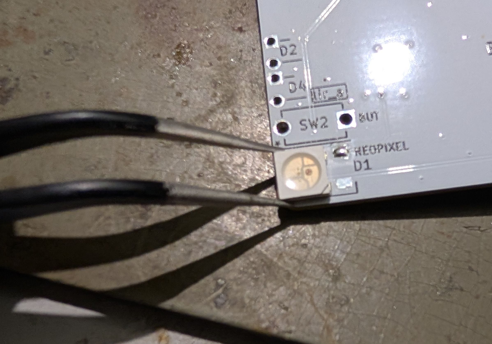
     
    <a><b>Part of the process to solder D1 Neopixel LED with tweezers</b></a>

> [!NOTE]  
> The Neopixel has a polarity or in other words a specific orientation that it must be placed in when soldering. You must place this part correctly in order for this Neopixel LED to work. Align this triangular indent on the Neopixel as shown below when soldering, highlighted in red. 

    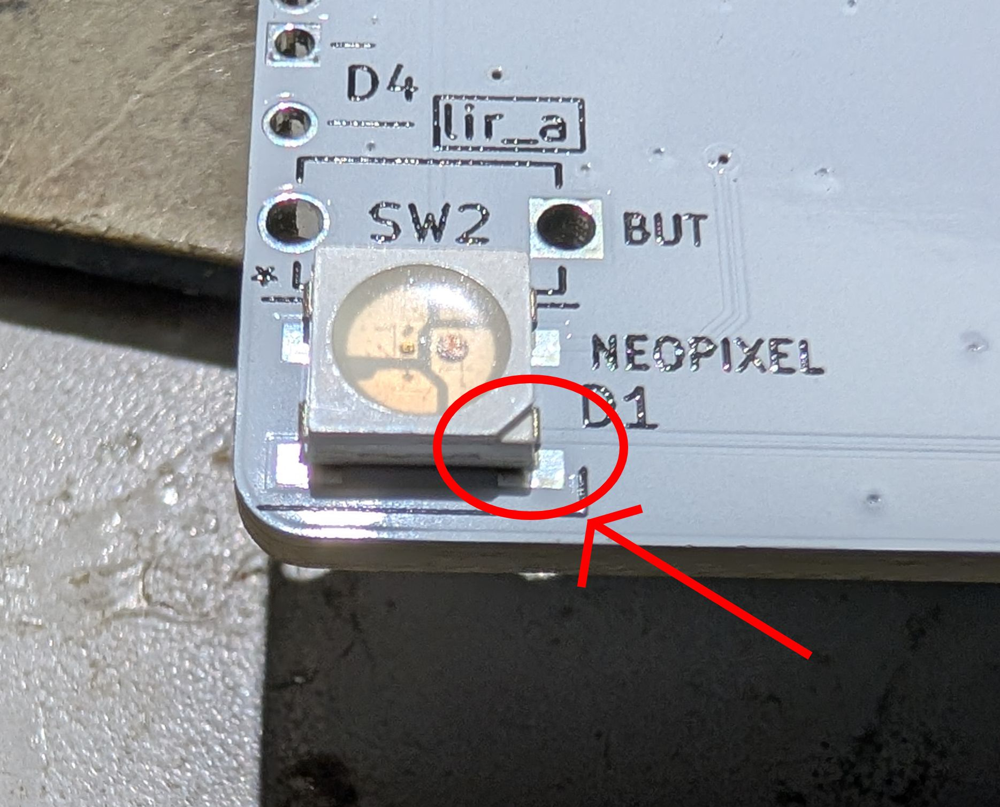
     
    <a><b>SMD LED Proper Orientation</b></a>

### Partial Mechanical Assembly

We will only partially assembly the mechanical parts of the mouse first before assembling it all in one go. We do this to make swapping out motors easier if one motor does not work (hopefully not the case). So just connect the put the motors into their 3D printed motor housing and connect them to the board using the cables for now. Then check if the motors work by running the sanity check that we talk more about below.

    
    
     
    <a><b>Partial Assembly</b></a>

> [!IMPORTANT]  
> Make sure that when you plug in the motor cables that they are plugged in all the way. Below are what a good motor cable plugged connection looks like and a bad one. Do this before running the sanity check code.

    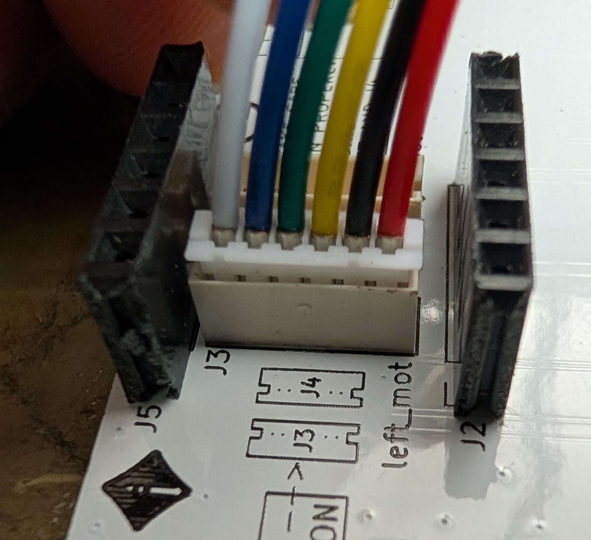
     
    <a><b>Good - Motor Cables plugged in all the way</b></a>

    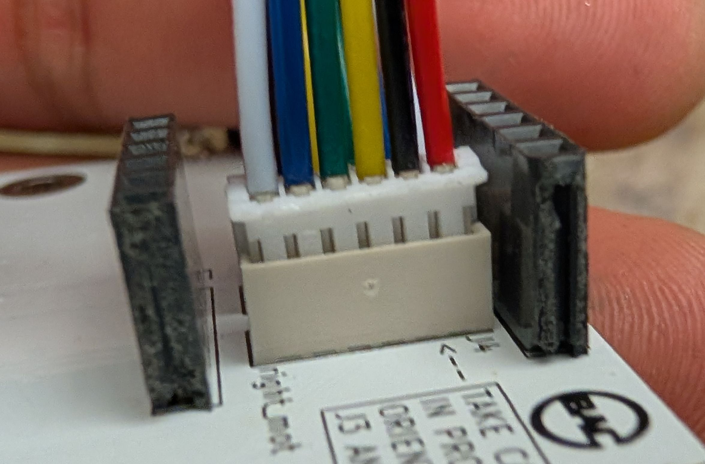
     
    <a><b>Bad - Motor Cables not plugged in all the way</b></a>

## Sanity Check

Now before we fully assembly your mouse we will make sure everything is working by running a [sanity check](sanity.md).
That means check to see that each of the 6 pairs of IR LEDs work, that each of the two motors spin as they should, and that the encoders work by outputting data that makes sense. You can find out more of what this means by following the [sanity check](sanity.md) document. 

## IR Calibration

If you placed your mouse against a reflective surface, you may have noticed that the IR readings change. Since our sensors are currently mounted perpendicular to the mouse, they pick up some reflection from the surface the mouse sits on. To fix this, we're going to bend our IR sensors ever so slightly upwards to compensate.

Bring up the sanity check again to the IR sensor printout section. Bend your IR sensors upwards just enough so that the difference between pointing them into free space and placing them on a surface is less than 2,000.

    
     
    <a><b>Bent IR Sensors</b></a>

### Final Mechanical Assembly

Yay you made it! Let's finish assembling the mouse. Follow the pictures below. The screw threads are printed into the plastic so don't overtighten them. Don't be afraid to apply a bit of force when attaching the wheels since a tighter fit improves concentricity.

    
    
    
    
    
     
    <a><b>Final Assembly</b></a>

### Checkoff #1

1. Show your mentor your assembled mouse, passing sanity check, and calibrated IR sensors.
