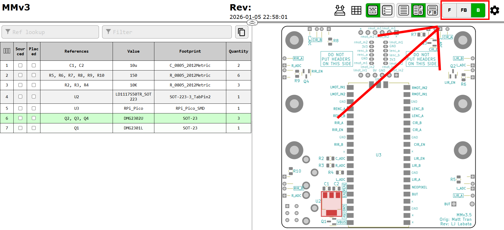

# Lab 2: Assembly

PLUG YOUR PI PICO INTO YOUR COMPUTER TO MAKE SURE IT SHOWS UP IN YOUR FILE SYSTEM BEFORE YOU SOLDER IT :D

## Assembly

Download the `ibom.html` from the [release](https://github.com/MrCroesus/MMv3/releases/download/MMv3.3/ibom.html) that matches your board revision and open it in your preferred browser. The interactive BOM (bill of materials) shows what parts are needed on your mouse's PCB (printed circuit board) and where they need to be placed.

To see images of all parts, see the Google Drive link [here](https://drive.google.com/drive/folders/1rGae82BSrE_mvmMwKTBHT9P-unDKIKQj?usp=sharing).

Also check the latest release for any manufacturing notes to make an older board functionally equivalent to the newest revision.

### Reflow Soldering

Let's start with the back of the PCB which is where the majority of parts are located. Click `B` in the top right to show just the back.

    
     
    <a><b>iBOM Back</b></a>

Rather than solder each part by hand, we'll use reflow soldering which does it all at once. In reflow soldering, we place components on top of pads covered in solder paste before sending the whole thing through an oven to melt the solder, making permanent joints.

    
     
    <a><b>Reflow Solder Process</b></a>

Let's start by applying the solder paste using a **solder stencil**. Instead of squeezing the perfect amount onto each pad by hand, we can do it all at once by spreading paste over a stencil with holes cut out precisely where we want paste. For a good solder paste application, it's important to make sure the stencil is flush against the PCB and stays aligned. The process is very forgiving, so don't worry if your paste looks messy or goes a bit outside the pads.

    
    
    
     
    <a><b>Solder Paste Application Process</b></a>

Now it's time for component placement. Following the `ibom.html`, place all of the components for the back side. None of the symmetric components have polarity, so don't worry about part orientation. Tweezers will be very useful, but don't squeeze too hard or your component will go flying. When placing components, press down gently so that it digs into the paste a bit to prevent it from moving. Again, the process is quite forgiving so don't worry if your parts aren't perfectly aligned as solder surface tension will generally pull them into alignment.

    
    
    
     
    <a><b>Component Placement</b></a>

> [!IMPORTANT]  
> Before moving on, double check that you correctly placed each component in the right place and the right orientation. Do so by checking below each box:
> - [ ] Are your MOSFET transistors in the right place? Remember that there are 3 x n-channel MOSFETs (Q2,Q3,Q4) and **1 x p-channel MOSFET (Q1)**.  
> - [ ] (Add more things to visually confirm...)
> - Finally you are ready to show one your TAs to give it one last lookover before getting reflowed.

Finally, let's reflow the solder! Throw your board into the reflow oven, load up the correct profile, and wait. With any luck, all of your joints will melt and the back side of your board will be done.

    
    
     
    <a><b>Reflow</b></a>

> [!IMPORTANT]  
> #### Testing Checkpoint #1 (COMPLETE THIS FIRST! Before moving on)
> - [ ] Connect your micromouse's pi pico to your computer and check that ______
> - [ ] Using the multimeter in lab probe these pads ______
> - [ ] Ensure that connections are made everywhere!

### Hand Soldering

The rest of the components need to be attached by hand. The general process is to heat up both the pad and the part before melting solder onto both of them. Adafruit has a great list of common issues and fixes which can be found [here](https://learn.adafruit.com/adafruit-guide-excellent-soldering/common-problems).  

    
     
    <a><b>How to Make a Solder Joint</b></a>

Let's start off with the mouse's main PCB. Click `F`, located in the top right of the `ibom.html`, to see the remaining components.

    
     
    <a><b>iBOM Front</b></a>

First we solder the IR LEDs. Note that the silkscreen should denote the polarity. The longer line corresponds to the longer leg of the IR LEDs. They also need to be mounted at a right angle so don't be afraid to bend them. Splaying the leads outward should hold them in place while you apply solder.

    
    
     
    <a><b>IR LEDs</b></a>

Next let's solder the SMD resistors and SMD capacitors. These SMD components use the same soldering process except there's no hole to stick the part through. Some of the parts do have polarity, so if you're unsure make sure to ask your mentor.

    
    
     
    <a><b>Some SMD Components</b></a>

Finally, let's add the bigger components! We saved these for last becuase if we did them any sooner it would make soldering the rest of the board more awkward. This is because the bigger components, like the battery connectors and motor connectors, would make it almost impossible to lay the pcb flat on a table.

> [!NOTE]
> Be sure that when you solder these bigger components, motor connectors and such, you place them on the correct side of the board! That side is the side opposite of the pi pico. DO NOT solder these bigger components on the same side as the green pi pico. You will save yourself a lot of headaches :D

    
     
    <a><b>The last THT Components Connectors</b></a>

Lastly, the DRV8833 motor driver board. Solder the two 6-pin headers onto the board and bridge the `en` pads as shown in the following pictures. The technique that I find works best is to solder just one pin first with the part in any orientation. Then reheat that joint while pressing on the part to move it into perfect alignment. Finally, do the rest of the pins.

    
    
    
    
     
    <a><b>DRV8833 Motor Driver Assembly</b></a>

With any luck, your board should be finished! At least all the soldering :)

    
     
    <a><b>Assembled PCB</b></a>

## Sanity Check

Now before we fully assembly your mouse we will make sure everything is working by running a [sanity check](sanity.md).
That means check to see that each of the 6 pairs of IR LEDs work, that each of the two motors spin as they should, and that the encoders work by outputting data that makes sense. You can find out more of what this means by following the [sanity check](sanity.md) document. 

## IR Calibration

If you placed your mouse against a reflective surface, you may have noticed that the IR readings change. Since our sensors are currently mounted perpendicular to the mouse, they pick up some reflection from the surface the mouse sits on. To fix this, we're going to bend our IR sensors ever so slightly upwards to compensate.

Bring up the sanity check again to the IR sensor printout section. Bend your IR sensors upwards just enough so that the difference between pointing them into free space and placing them on a surface is less than 2,000.

    
     
    <a><b>Bent IR Sensors</b></a>

### Mechanical Assembly

Yay you made it! Let's finish assembling the mouse. Follow the pictures below. The screw threads are printed into the plastic so don't overtighten them. Don't be afraid to apply a bit of force when attaching the wheels since a tighter fit improves concentricity.

    
    
    
    
    
     
    <a><b>Final Assembly</b></a>

### Checkoff #1

1. Show your mentor your assembled mouse, passing sanity check, and calibrated IR sensors.
