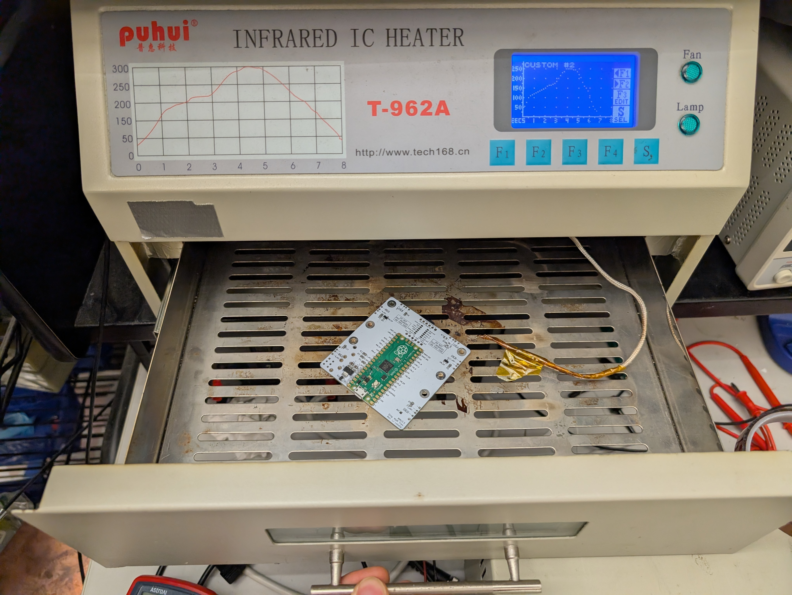
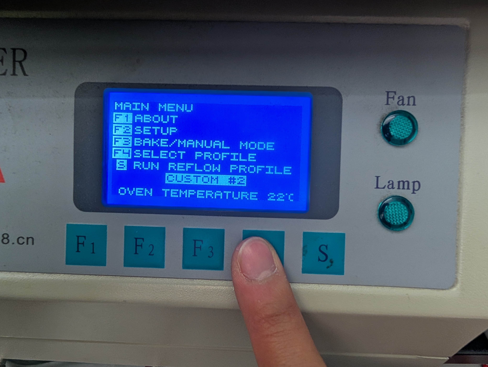
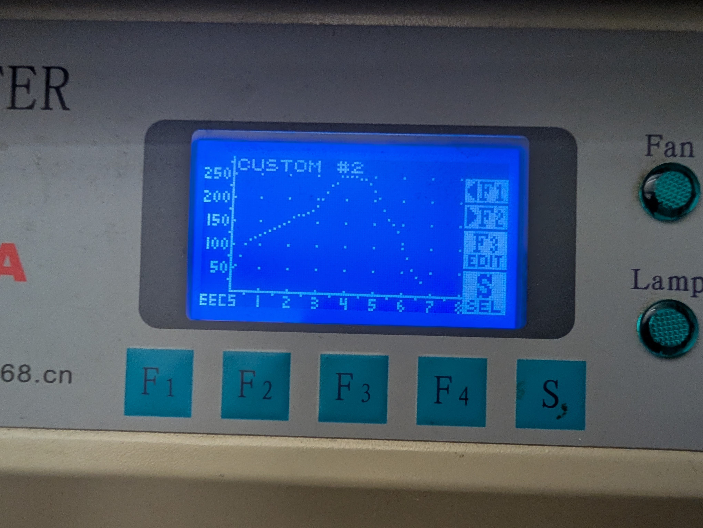
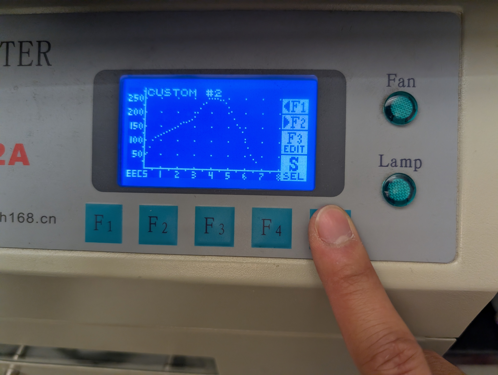
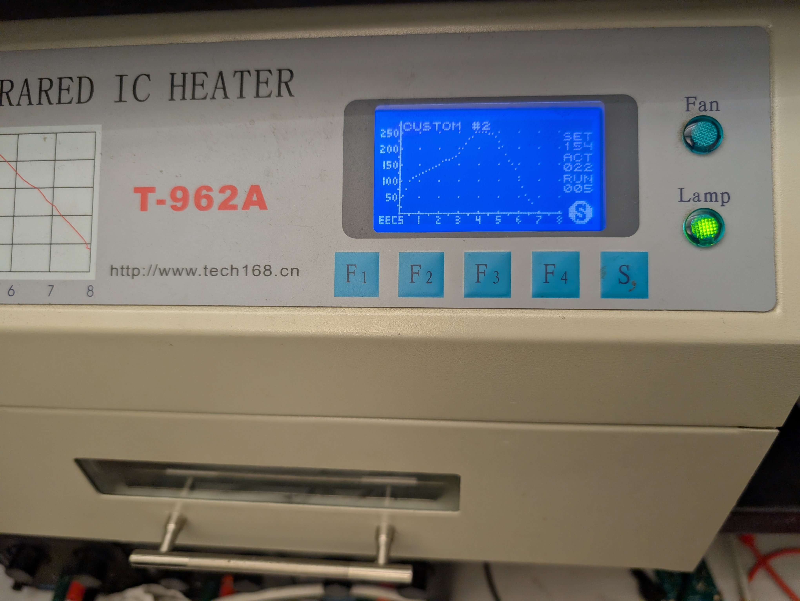

# Guide: Reflow Soldering Ovens

## Before You Start

* **Inspect PCB:** Components placed correctly, no loose parts.
* **Ensure ventilation is on:** Open the window in SuperNode and turn on the soldering fume extractor
* **Important Note:** The fuse on the reflow oven can melt if the oven is used too many times in a row. Please space out usage and give it time to rest.

## Setting Up the Reflow Oven

### 1. Place the Temperature Probe

    
     
    <a><b>Place in Oven</b></a>

The termperature probe is at the end of the white wire. Make sure the probe is not touching heating elements or walls. Ideally, position it near the PCB so it accurately reflects board temperature. Up to two PCBs can be placed in the oven at once.

---

### 2. Power On and Reach the Main Menu

    
     
    <a><b>Main Menu</b></a>

Turn on the oven using the switch in the back and wait for it to boot. You should see the Main Menu screen. Choose F4 to select the profile.

---

### 3. Select the Correct Custom Profile Menu

    
     
    <a><b>Choose Custom 2</b></a>

Custom profiles are used for the correct reflow curves. Use F1 and F2 to scroll between the different profiles until you reach CUSTOM #2. Its curve should look similar to the curve printed on the oven to the left. The peak temperature is approximately 250 degrees.

 

    
     
    <a><b>Select</b></a>

Click S to select this profile when done.

 

---

### 4. Start the Reflow Cycle

    
     
    <a><b>Click Run</b></a>

    
     
    <a><b>Oven is on</b></a>

Press S again to begin the reflow process. The LED indicator should be turned on as shown in the second photo. The oven will automatically progress through the temperatures and is progress will be shown on screen. 

## After the Reflow Cycle

Wait until the oven indicates the cycle is complete and allow some time for it to cool. Carefully remove the board using tweezers or gloves. 

Inspect solder joints for proper connections and no bridging. 
If there are one or two incorrectly done joints or a component has fallen off, they can be hand soldered after.

---

**You’re done!** Once you’ve completed these steps, your PCB should be properly reflow soldered and ready for the rest of assembly.

