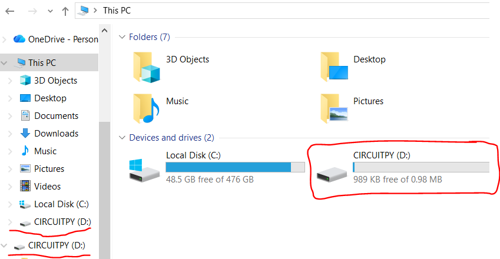
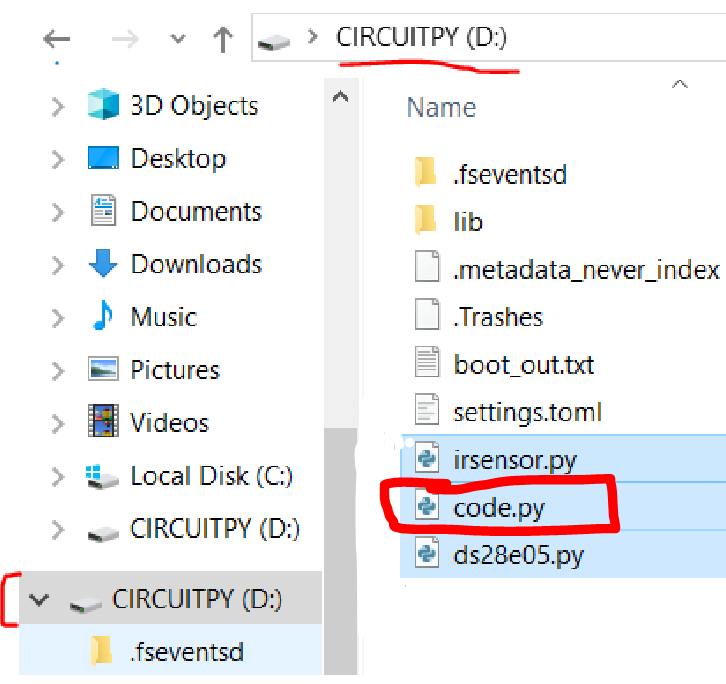

# Sanity

This lab provides the instructions and code to test all aspects of your mouse and identify any hardware defects. If at any point in this lab a test is not passed, refer to this document to [troubleshoot](troubleshooting.md) your mouse. If, after trying to troubleshoot your mouse on your own with the aforementioned document, it is still not working, ask an instructor for further help debugging.

1. Upload the firmware onto your Raspberry Pi Pico

Plug the mouse, aka the Pi Pico, into your computer and upload the latest **firmware.uf2** (see [releases](https://adafruit-circuit-python.s3.amazonaws.com/bin/raspberry_pi_pico/en_US/adafruit-circuitpython-raspberry_pi_pico-en_US-8.2.0.uf2) by dragging the file into the `RPI-RP2` folder that shows up. The RPI-RP2 folder is shown in the following image.

[TODO: ADD RPI-RP2 Drive Directory Example image]
*RPI-RP2 Drive Directory Example image*

It should disappear and reappear as a `CIRCUITPY` folder. As the following image shows.

    
     
    <a><b>Updated CIRCUITPY Drive Directory Example image in Windows 10 File Explorer</b></a>

> [!NOTE]  
> If you've uploaded firmware before onto the Pi Pico, you'll need to hold the `BOOTSEL` button on the Pi Pico while plugging in. In more detail, first make sure to unplug the Pi Pico from your computer, then hold the `BOOTSEL` button on the Pi Pico. Then, while holding the `BOOTSEL` button, plug the Pi Pico back in. The Pico should appear as a  USB Mass Storage Device, RPI-RP2. You can now stop holding the `BOOTSEL` button. (For more information, see: [Chapter 4. Applications information
4.1. Programming the flash](https://pip-assets.raspberrypi.com/categories/610-raspberry-pi-pico/documents/RP-008307-DS-1-pico-datasheet.pdf?disposition=inline))

2. Upload the CircuitPython libraries and custom firmware onto your Pi Pico

Download this [sanity.zip](https://github.com/charlessu800/MMv3/releases/download/MMv3.5/sanity.zip) file and unzip it into your Pi Pico directory. Your Pi Pico's directory should now look like this, with all the newly added files and folders:
* CIRCUITPYTHON/
    * **lib/**
        * **adafruit_motor/**
        * **adafruit_onewire/**
        * **neopixel.mpy**
    * **ds28e05.py**
    * **irsensor.py**
    * code.py

(**Bolded text represents the new files and folders that you will have added**)

If the .zip file method above is not working, then you can follow the steps below to manually download the files from CircuitPython and GitHub.

Alternatively, Manually Download From CircuitPython and GitHub

Download the CircuitPython [libraries](https://circuitpython.org/libraries) (Bundle for Version 8.x or 7.x, 9.x is untested! If you'd like you could test it for us ;) ), right click on 8.x -> open in new tab, unzip the file and upload the following folders and files to the lib/ folder on your mouse.
* adafruit_motor/
* adafruit_onewire/
* neopixel.mpy

Upload these files from this folder, [labs/sanity](../labs/sanity), into the top level of the Pi Pico directory.
* ds28e05.py
* irsensor.py

 

3. Upload the Sanity program code into your Pi Pico

Copy the contents of this [`sanity/code.py`](../labs/sanity/code.py) file into your Pi Pico's already existing `code.py` file. You will need a text editor to open up this file (shown in the image below) to copy and paste the sanity code. I would recommend you use VSCode, but any text editor can do. If you do not know how, please ask one of our TAs for help :)

    
     
    <a><b>Location in your Raspberry Pi Pico of where to paste the files into</b></a>

4. Find the associated serial port for your mouse.
    

    
Windows

    Open up `Device Manager` and check the `Ports (COM & LPT)` dropdown. Your serial (COM) port is one of those. If it's hard to identify, try unplugging and replugging your mouse and see which COM port disappears.

    

    

    
MacOS

    Run `ls  /dev/tty.*` in Terminal. The correct port is one of those. If it's hard to identify, try unplugging and replugging your mouse and see which port disappears. It should be something like /dev/tty.usbmodem101

    

    

    
Linux

    Hello there! A fellow power user you are. Your distro may be different, but chances are it's under something like `/dev/ttyACM0`.
    

5. Bring up a serial monitor on that serial port (baud rate doesn't matter). There are many options of software to use, but the following are what I personally use.
    * **Windows** - [PuTTY](https://www.chiark.greenend.org.uk/~sgtatham/putty/latest.html) Open up putty -> Serial -> Enter COM[X] -> Run
    * **MacOS** - [SerialTools](https://apps.apple.com/us/app/serialtools/id611021963?mt=12) or [screen](https://en.wikipedia.org/wiki/GNU_Screen) after running ls /dev/tty.* youre going to type into your terminal -> screen "whatever you identified as the correct port". Then press control-c or control-d, you should see some text pop up! If this doesn't work, its a bit finiky, open up serialTools to the terminal tab change your serial port to the usb you identified and press the connect button on the right hand side. After, press control-c or control-d. If this doesn't work try going back to screen or using the VScode Serial tools extensions
    * **Linux** - [screen](https://en.wikipedia.org/wiki/GNU_Screen)
6. Follow the instructions printed in the serial monitor. You may have to press CTRL-C and CTRL-D to reset if you don't see anything.
    * IR sensor readings should be around 30,000-60,000 without a surface in front of them and under 5,000 with your hand right in front of them. Speak to a staff member if you need help with this part of the lab!
    * Spin the wheels manually, Encoders should be \~217 ticks per revolution, use the divot in the wheel as a guide :).

[TODO: update the following below to include circuitpython . org and vscode with serial monitor extension! For both mac/linux/windows etc! and also include the mu text editor. Also add more photos!]
