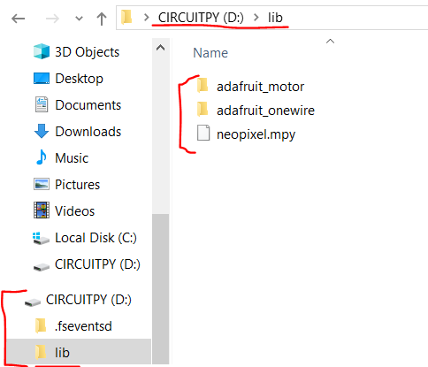
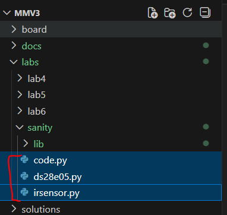
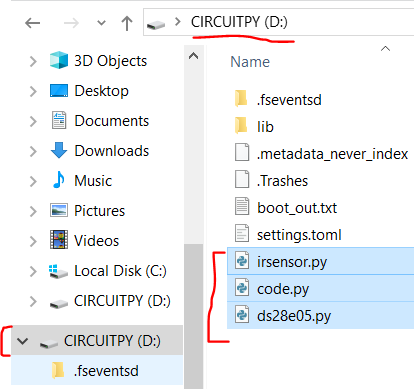

# Sanity

This lab provides the instructions and code to test all aspects of your mouse and identify any hardware defects. If at any point in this lab a test is not passed, ask an instructor for help debugging.

[TODO: find someone else documentation on using git and vscode and bash and everything. fuck wait this is weird how???]

0. Git Clone this repository. 

[TODO: ADD RPI-RP2 Drive Directory Example image]

1. Upload the firmware onto your Raspberry Pi Pico

Plug mouse into your computer and upload the latest **firmware.uf2** (see [releases](https://adafruit-circuit-python.s3.amazonaws.com/bin/raspberry_pi_pico/en_US/adafruit-circuitpython-raspberry_pi_pico-en_US-8.2.0.uf2) by dragging the file into the `RPI-RP2` folder that shows up. The RPI-RP2 folder is shown in the following image.

*RPI-RP2 Drive Directory Example image*

It should disappear and reappear as a `CIRCUITPY` folder. As the following image shows.

*Updated CIRCUITPY Drive Directory Example image in Windows 10 File Explorer*

> [!NOTE]  
> If you've uploaded firmware before, you'll need to hold the `BOOTSEL` button on the Pi Pico while plugging in. In more detail, first make sure to unplug the Pi Pico from your computer then hold the `BOOTSEL` button on the Pi Pico. Then while holding the `BOOTSEL` button plug the Pi Pico back. The Pico should appear as a  USB Mass Storage Device, RPI-RP2. You can now stop holding the `BOOTSEL` button. (For more information see: [Chapter 4. Applications information
4.1. Programming the flash](https://pip-assets.raspberrypi.com/categories/610-raspberry-pi-pico/documents/RP-008307-DS-1-pico-datasheet.pdf?disposition=inline))

<!-- 2. Download the CircuitPython [libraries](https://circuitpython.org/libraries) (Bundle for Version 8.x or 7.x, 9.x is untested! If you'd like you could test it for us ;) ), right click on 8.x -> open in new tab, unzip the file and upload the following folders and files to the lib/ folder on your mouse.
    * adafruit_motor/
    * adafruit_onewire/
    * neopixel.mpy -->
[TODO: remove the adafruit_onewire code and library since not needed]

2. Upload the CircuitPython libraries into your Pi Pico

Copy the contents of this folder, [sanity/lib](../labs/sanity/lib)

*Location of sanity/lib folder you will copy from*

and paste them into this folder, `$(CIRCUITPY)/lib`, in your Pi Pico. 

(NOTE: `$(CIRCUITPY)` is used in this context to represent the file path of wherever your Raspberry Pi Pico is located in your PC)

*Location of $(CIRCUITPY)/lib folder you will paste into*

3. Upload the the Sanity program code into your Pi Pico

Copy only these files in the folder, [sanity/](../labs/sanity/)
* [code.py](../labs/sanity/code.py)
* [ds28e05.py]([../labs/sanity/ds28e05.py)
* [irsensor.py](../labs/sanity/irsensor.py)

into the CircuitPython drive, `$(CIRCUITPY)`, that shows up when you plug your mouse into your computer.

 
*Location of the files in the sanity folder you need to copy*

*Location in your Raspberry Pi Pico of where to paste the files into*

4. Find the associated serial port for your mouse.
    

    
Windows

    Open up `Device Manager` and check the `Ports (COM & LPT)` dropdown. Your serial (COM) port is one of those. If it's hard to identify, try unplugging and replugging your mouse and see which COM port disappears.

    

    

    
MacOS

    Run `ls  /dev/tty.*` in Terminal. The correct port is one of those. If it's hard to identify, try unplugging and replugging your mouse and see which port disappears.

    

    

    
Linux

    Hello there! A fellow power user you are. Your distro may be different, but chances are it's under something like `/dev/ttyACM0`.

    

5. Bring up a serial monitor on that serial port (baud rate doesn't matter). There are many options of software to use, but the following are what I personally use.
    * **Windows** - [PuTTY](https://www.chiark.greenend.org.uk/~sgtatham/putty/latest.html) Open up putty -> Serial -> Enter COM[X] -> Run
    * **MacOS** - [SerialTools](https://apps.apple.com/us/app/serialtools/id611021963?mt=12) or [screen](https://en.wikipedia.org/wiki/GNU_Screen) after running ls /dev/tty.* youre going to type into your terminal -> screen "whatever you identified as the correct port". If this doesn't work, its a bit finiky, open up serialTools to the terminal tab change your serial port to the usb you identified and press the connect button on the right hand side. After, press disconnect and do the terminal instructions again.
    * **Linux** - [screen](https://en.wikipedia.org/wiki/GNU_Screen)
6. Follow the instructions printed to the serial monitor. You may have to press CTRL-C and CTRL-D to reset if you don't see anything.
    * IR sensor readings should be around 30,000-60,000 without a surface in front of them and under 5,000 with your hand right in front of them. Speak to a staff member if you need help with this part of the lab!
    * Spin the wheels manually, Encoders should be \~217 ticks per revolution, use the divot in the wheel as a guide :).
